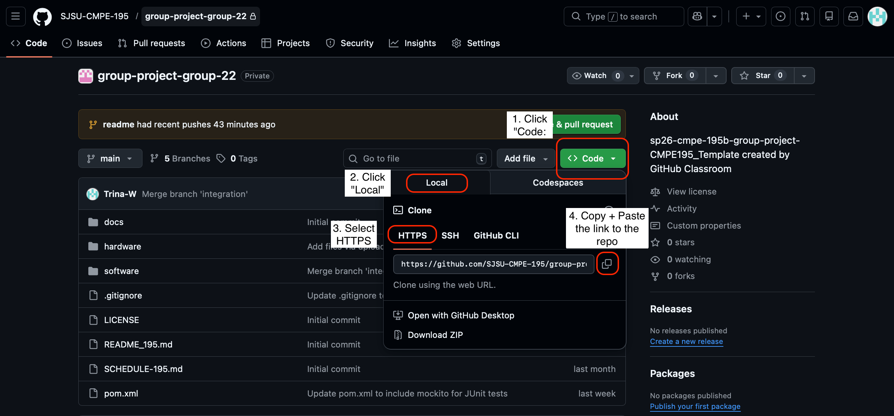

# Hardware Spiking Neural Network (SNN)

We are developing a custom, transistor-level spiking neural network (SNN) that will be used to compete against a human player to play the game Pong. This project is comprised of software game and a hardware neural network. 

## Team - (Group 32)
- Jonathon Fleming | [@JellyF02](https://github.com/JellyF02) | jonathon.fleming@sjsu.edu |
- Andrew Neidhart | [@andrewneidhart](https://github.com/andrewneidhart) | andrew.neidhart@sjsu.edu |
- Raymund Mercader | [@ray-sjsu](https://github.com/ray-sjsu) | raymund.mercader@sjsu.edu |
- Katrina Weers | [@Katrina Weers](https://github.com/Trina-W) | katrina.weers@sjsu.edu |

## Prerequisites
Software, tools, accounts, etc. needed before setup

### Software: 
    - IDE of choice
    - [Git](https://git-scm.com/install/)
    - [Java JDK 17](https://docs.oracle.com/en/java/javase/21/install/overview-jdk-installation.html)
    - [Apache Maven 3.X](https://maven.apache.org/install.html)

### Hardware:
    - ESP 32 microcontroller connected via USB/Serial
    - Neural network circuit assembled on breadboard 

## Installation Steps
How to set up this project

1. Install Java JDK 16+
2. Install Apache Maven 3.6+ 
3. Clone the repository
    1. From here 
        
        *From the github page go to code > HTTPS > copy the repo link > clone using the URL https://github.com/SJSU-CMPE-195/group-project-group-22.git*
        ```
            git clone https://github.com/SJSU-CMPE-195/group-project-group-22.git
        ```

    2. cd into the project folder 
    ```
        cd group-project-group-22/software
    ```

4. Connect ESP32 via USB 
5. Build the project
    ```
        mvn install
    ```
6. Run the game
    ```
        mvn exec:java -Dexec.mainClass="edu.sjsu.spring2026.group32.pong.PongGame"
    ```


## Configuration
[How to configure environment variables, API keys, etc.]

## Running the Application
[Commands to start the application]

## Usage
[Basic instructions on how to use the application]

## Project Structure
[Brief overview of folder/file organization]