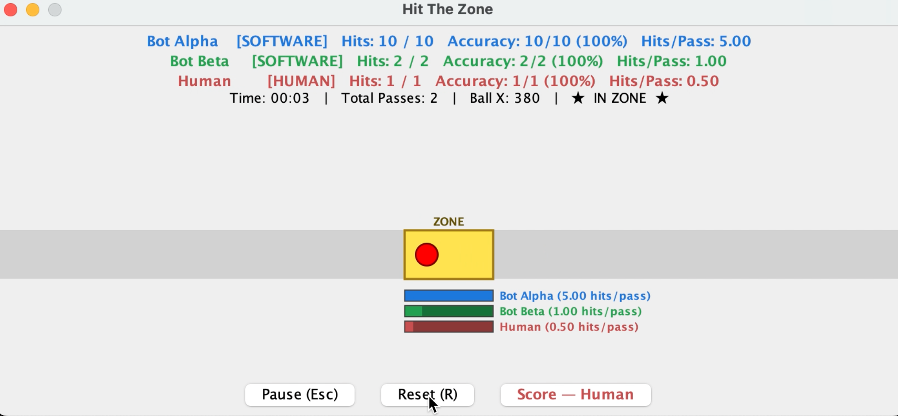

# Hardware Spiking Neural Network (SNN)

[](https://github.com/SJSU-CMPE-195/group-project-group-22/actions/workflows/ci.yml)
[](https://github.com/SJSU-CMPE-195/group-project-group-22/actions/workflows/ci.yml)

This project is a custom, transistor-level spiking neural network (SNN) that will be used to compete against a human player to play the game Pong. It is comprised of software game and AI model made in Java and a hardware neural network. 

## Deployed Application

The latest runnable JAR is published as a GitHub Actions artifact on every successful push to `main`.

**[View latest CI run & download artifacts →](https://github.com/SJSU-CMPE-195/group-project-group-22/actions/workflows/ci.yml)**

From the most recent successful run, download `hardware-neural-network-jar` from the **Artifacts** panel, then follow the [Running the Application](#running-the-application) instructions below.

## Team - (Group 32)
- Jonathon Fleming | [@JellyF02](https://github.com/JellyF02) | jonathon.fleming@sjsu.edu |
- Andrew Neidhart | [@andrewneidhart](https://github.com/andrewneidhart) | andrew.neidhart@sjsu.edu |
- Raymund Mercader | [@ray-sjsu](https://github.com/ray-sjsu) | raymund.mercader@sjsu.edu |
- Katrina Weers | [@Katrina Weers](https://github.com/Trina-W) | katrina.weers@sjsu.edu |

## Prerequisites
Software, tools, accounts, etc. needed before setup

Software: 
- IDE of choice
- [Git](https://git-scm.com/install/)
- [Java JDK 17](https://docs.oracle.com/en/java/javase/21/install/overview-jdk-installation.html)
- [Apache Maven 3.6](https://maven.apache.org/install.html)

Hardware:
- ESP 32 microcontroller connected via USB/Serial
- Neural network circuit assembled on breadboard 

## Installation Steps
How to set up this project

1. Install Java JDK 17+
2. Install Apache Maven 3.6+ 
3. Clone the repository
    1. On this page: go to code > HTTPS > copy the repo link > clone using the URL https://github.com/SJSU-CMPE-195/group-project-group-22.git
        In your IDE terminal type: 
        ```
        git clone https://github.com/SJSU-CMPE-195/group-project-group-22.git
        ```

    2. cd into the project folder 
    ```
    cd group-project-group-22/software
    ```

4. Connect ESP32 via USB 

5. Build the project
    ```
    mvn install
    ```

6. Run the game
    ```
    mvn exec:java -Dexec.mainClass="edu.sjsu.spring2026.group32.sandbox.PoC_HitTheZone"
    ```


## Configuration
How to configure environment variables, API keys, etc.

**No API keys or environment variables are required.**


## Running the Application
Commands to start the application

Navigate to the software directory from the root of the cloned repository:
    ```
    cd group-project-group-22/software
    ```

build the project in maven
    ```
    mvn install 
    ```

run the PoC
    ```
    mvn exec:java -Dexec.mainClass="edu.sjsu.spring2026.group32.sandbox.PoC_HitTheZone"
    ```


## Running Tests

### Unit & Integration Tests

Navigate to the `software` directory and run the full test suite with JaCoCo coverage:

```bash
cd group-project-group-22/software
mvn verify
```

> **Note:** Tests that instantiate Swing components (e.g. `PoCTest`) require a display. On Linux/CI, prefix the command with `xvfb-run --auto-servernum`.

### Test Coverage Report

JaCoCo generates an HTML report at `software/target/site/jacoco/index.html` after `mvn verify`. Open it in a browser to browse line-by-line coverage.

The latest coverage report is also uploaded as the **`jacoco-coverage-report`** artifact on every CI run — see [Actions](https://github.com/SJSU-CMPE-195/group-project-group-22/actions/workflows/ci.yml).

### Stress / Performance Tests

To run only the throughput benchmarks (no Swing required):

```bash
cd group-project-group-22/software
mvn test -Dgroups=stress
```

Results are printed to the console and documented in [`docs/evaluation/stress-test-results.md`](docs/evaluation/stress-test-results.md).

### Run a Specific Test Class

```bash
mvn test -Dtest=NeuralSignalParserTest
```

## Usage
Basic instructions on how to use the application


The PoC demo showcases the hardware neural network against software bots, hardware AI, and a human player. 

Players: 
- Bot Alpha/Beta: software AI players
- Human (user): presses Space when the ball is inside the yellow zone to score
- Hardware: ESP32 neural network player (neuron)

*Proof of Concept Screen*

Controls: 
- Space: Hits the ball when inside zone
- Esc: Pauses the game
- R: Resets the game

Recorded Stats:
- Hits: successful hits out of total attempts
- Accuracy: hit percentage
- Hits/Pass: average hits per pass of the ball

## Project Structure
Brief overview of folder/file organization

### Hardware
- Schematics: contains LTspice schematic files with version history of neuron circuit diagrams 

### Software
- src/
    - main/ 
        - hardware/ Java program for connecting to ESP32 
        - player/ core player abstractions and implementations
        - pong/ for fully developed game 
        - sandbox/ *location of PoC under PoC_HitTheZone.java*
    - test/ for implementing testing with JUnit and Mockito
        - hardware/ hardware test cases
        - sandbox/ PoC test cases
- pom.xml for Maven dependencies 
