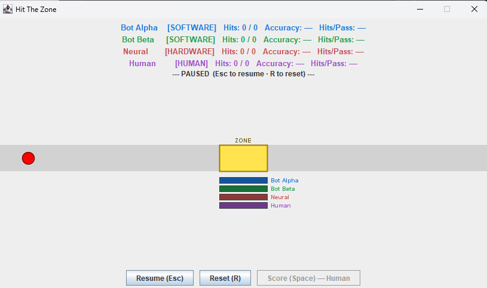

# Hardware Spiking Neural Network (SNN)

[](https://github.com/SJSU-CMPE-195/group-project-group-22/actions/workflows/ci.yml)
[](https://github.com/SJSU-CMPE-195/group-project-group-22/actions/workflows/ci.yml)

This project is a custom, transistor-level spiking neural network (SNN) that will be used to compete against a human player to play the games HitTheZone and Pong. There is a launcher with two software games. Each game has their own Java software AI model(s) and a hardware neural network AI model.

## Table of Contents

- [Deployed Application](#deployed-application)
- [Team](#team---group-32)
- [Prerequisites](#prerequisites)
- [Hardware Setup](#hardware-setup)
- [Software Setup](#software-setup)
- [Configuration](#configuration)
- [Testing](#testing)
- [Usage](#usage)
- [Project Structure](#project-structure)

---

## Deployed Application

The latest runnable JAR is published as a GitHub Actions artifact on every successful push to `main`.

**[View latest CI run & download artifacts →](https://github.com/SJSU-CMPE-195/group-project-group-22/actions/workflows/ci.yml)**

From the most recent successful run, download `hardware-neural-network-jar` from the **Artifacts** panel, then follow the [Software Setup](#software-setup) instructions below.

---

## Team - (Group 32)

| Name | GitHub | Email |
|---|---|---|
| Jonathon Fleming | [@JellyF02](https://github.com/JellyF02) | jonathon.fleming@sjsu.edu |
| Andrew Neidhart | [@andrewneidhart](https://github.com/andrewneidhart) | andrew.neidhart@sjsu.edu |
| Raymund Mercader | [@ray-sjsu](https://github.com/ray-sjsu) | raymund.mercader@sjsu.edu |
| Katrina Weers | [@Trina-W](https://github.com/Trina-W) | katrina.weers@sjsu.edu |

---

## Prerequisites

Software, tools, accounts, etc. needed before setup.

**Software:**
- IDE of choice
- [Git](https://git-scm.com/install/)
- [Java JDK 17](https://docs.oracle.com/en/java/javase/21/install/overview-jdk-installation.html)
- [Apache Maven 3.6](https://maven.apache.org/install.html)
- [Arduino IDE](https://www.arduino.cc/en/software) (for flashing the ESP32)

**Hardware:**
- ESP32 microcontroller connected via USB/Serial
- Neural network circuit assembled on breadboard or PCB (see [Hardware Setup](#hardware-setup))

---

## Hardware Setup

### Breadboard Assembly (NeuronSynapseVersion7)

The breadboard build uses the **NeuronSynapseVersion7** schematic, found in `hardware/Schematics/`. Follow these general steps:

1. Gather all required components per the schematic's bill of materials.
2. Place the ESP32 module on the breadboard and orient it so both rows of pins are accessible on each side.
3. Wire the neuron circuit section by section, following the schematic from left to right. Work one subcircuit (e.g., input stage, threshold comparator, output stage) at a time and verify each before proceeding.
4. Connect the neuron output node to **GPIO34 (ADC6)** on the ESP32.
5. Connect the neuron input/stimulation node to **GPIO25 (DAC1)**.
6. Optionally wire a status LED to **GPIO2**.
7. For the dual-channel (Pong) configuration, wire a second neuron output to **GPIO35 (ADC7)** and its input to **GPIO26 (DAC2)**.
8. Double-check all power rails (3.3 V and GND) before applying power.

### PCB Assembly

The PCB design is electrically identical to the breadboard build — all connections, pin assignments, and component values are the same. The PCB is simply a much smaller, more compact form factor. Assemble it following the same schematic and the same verification steps above.

### Flashing the ESP32

The firmware lives in `hardware/firmware/`. There are two pre-configured `.ino` files, but they are functionally identical — the only difference is a single compile-time parameter, `CHANNEL_COUNT`, that selects the hardware configuration:

| `CHANNEL_COUNT` | Configuration | Used by |
|---|---|---|
| `1` | 3-neuron, single ADC channel (GPIO34) | Hit The Zone |
| `2` | 6-neuron, dual ADC channels (GPIO34 + GPIO35) | Pong |

**Steps:**

1. Open the desired `.ino` file in **Arduino IDE**:
    - `NeuralSerial_SingleChannel_3Neuron.ino`
    - — or —
    - `NeuralSerial_DualChannel_6Neuron.ino`
2. Near the top of the file, locate the configuration block and confirm or change `CHANNEL_COUNT`:
   ```cpp
   // Set CHANNEL_COUNT to 1 for 3-neuron HitTheZone config.
   // Set CHANNEL_COUNT to 2 for 6-neuron Pong config.
   #define CHANNEL_COUNT 1
   ```
3. In Arduino IDE, select **Tools → Board → ESP32 Dev Module** (or your specific ESP32 variant).
4. Select the correct port under **Tools → Port**.
5. Click **Upload**. The IDE will compile and flash the firmware to the ESP32.
6. Open the **Serial Monitor** (115200 baud) to confirm the board is sending data.

---

## Software Setup

### Running the Launcher

The **Launcher** is the central hub for all programs.

**Recommended — download the latest JAR from CI:**

1. Go to the [latest CI run](https://github.com/SJSU-CMPE-195/group-project-group-22/actions/workflows/ci.yml) and download the `hardware-neural-network-jar` artifact.
2. Run it:
   ```bash
   java -jar hardware-neural-network.jar
   ```

**Alternative — build from source:**

1. Clone the repository and navigate to the software directory:
   ```bash
   git clone https://github.com/SJSU-CMPE-195/group-project-group-22.git
   cd group-project-group-22/software
   ```
2. Build with Maven:
   ```bash
   mvn install
   ```
3. Run the produced JAR:
   ```bash
   java -jar target/hardware-neural-network.jar
   ```

The Launcher window provides two serial connection panels (one for Hit The Zone, one for Pong) and three buttons to open programs. Connect your ESP32 device(s) in the Launcher before launching a program to enable hardware AI players. Programs can also be launched without hardware — the neural player will simply be skipped.

### Bidirectional Test

A serial communication tester. It receives both Launcher-managed connections (Hit The Zone and Pong) and lets you switch between them to verify bidirectional data flow between the ESP32 and Java.

### Hit The Zone

A small game demo that pits the hardware neural network against software AI bots and a human player. The ESP32 (3-neuron, single-channel config) reads from **GPIO34** and plays as the "Neural" player. See the [Usage](#usage) section for controls and rules.

### Pong Game

The full Pong game where the hardware SNN competes as an AI paddle controller. The ESP32 (6-neuron, dual-channel config) reads two ADC channels — **GPIO34** for LEFT movement and **GPIO35** for RIGHT — feeding a single `PongHardwareAI` player. Player selection (Human / Hardware / AI Easy / AI Hard) is handled from the in-game toolbar.

---

## Configuration

**No API keys or environment variables are required.**

The only configuration is the firmware `CHANNEL_COUNT` parameter described in [Flashing the ESP32](#flashing-the-esp32).

---

## Testing

### Unit & Integration Tests

Navigate to the `software` directory and run the full test suite with JaCoCo coverage:

```bash
cd group-project-group-22/software
mvn verify
```

> **Note:** Tests that instantiate Swing components require a display. On Linux/CI, prefix the command with `xvfb-run --auto-servernum`.

### Test Coverage Report

JaCoCo generates an HTML report at `software/target/site/jacoco/index.html` after `mvn verify`. Open it in a browser to browse line-by-line coverage.

The latest coverage report is also uploaded as the **`jacoco-coverage-report`** artifact on every CI run — see [Actions](https://github.com/SJSU-CMPE-195/group-project-group-22/actions/workflows/ci.yml).

### Stress / Performance Tests

To run only the throughput benchmarks (no Swing required):

```bash
cd group-project-group-22/software
mvn test -Dgroups=stress
```

Results are printed to the console and documented in [`docs/evaluation/stress-test-results.md`](docs/evaluation/stress-test-results.md).

### Run a Specific Test Class

```bash
mvn test -Dtest=NeuralSignalParserTest
```

---

## Usage

The Hit The Zone game demo showcases the hardware neural network against software bots, hardware AI, and a human player.

Players:
- **Bot Alpha / Beta:** software AI players
- **Human (user):** presses Space when the ball is inside the yellow zone to score
- **Hardware:** ESP32 neural network player (neuron)

*Game - Hit The Zone Screen*

Controls:
- **Space:** Hits the ball when inside zone
- **Esc:** Pauses the game
- **R:** Resets the game

Recorded Stats:
- **Hits:** successful hits out of total attempts
- **Accuracy:** hit percentage
- **Hits/Pass:** average hits per pass of the ball

---

## Project Structure

Brief overview of folder/file organization.

### Hardware
- `Schematics/` — LTspice schematic files with version history of neuron circuit diagrams
- `firmware/` — ESP32 Arduino firmware (NeuralSerial, single- and dual-channel)

### Software
- `src/`
    - `main/`
        - `hardware/` — Java program for connecting to ESP32
        - `launcher/` — Launcher hub and serial connection panels
        - `player/` — core player abstractions and implementations
        - `pong/` — fully developed Pong game
        - `sandbox/` — Hit The Zone game demo
    - `test/` — JUnit and Mockito test cases
        - `hardware/` — hardware test cases
        - `sandbox/` — Hit The Zone game demo test cases
        - `launcher/` — Launcher test cases
- `pom.xml` — Maven dependencies
