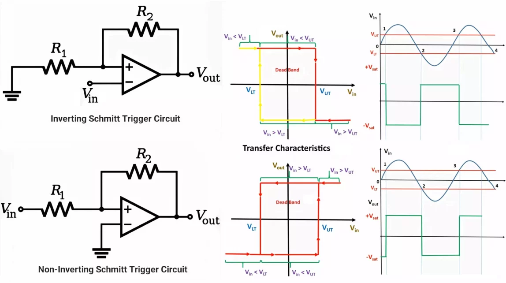
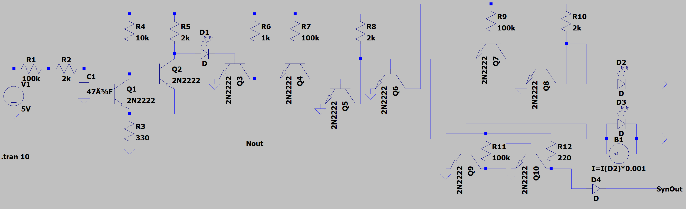
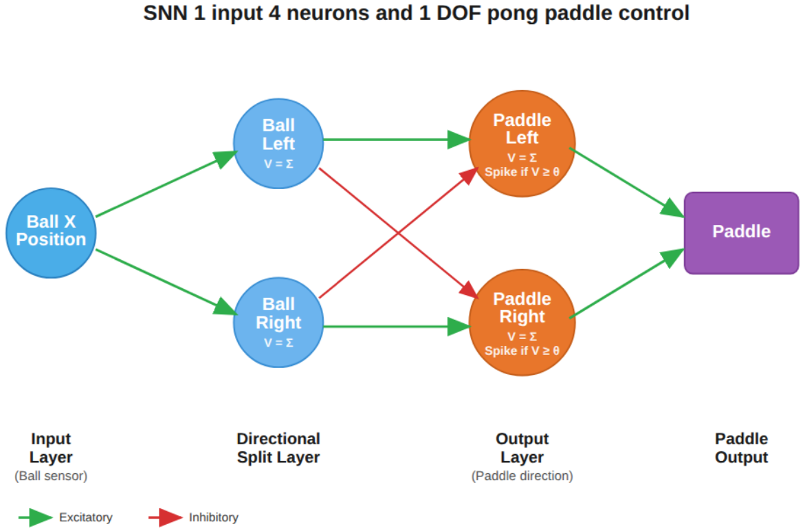

# (Neuromorphic) Hardware Neural Network

[](https://github.com/SJSU-CMPE-195/group-project-group-22/actions/workflows/ci.yml)
[](https://github.com/SJSU-CMPE-195/group-project-group-22/actions/workflows/ci.yml)

Neuromorphic computing replicates brain structure and function directly in hardware. Unlike conventional processors, it uses parallel, event-driven processing for greater efficiency. Software-based spiking neural networks (SNNs) appear in autonomous control systems but carry high energy and resource costs. This project implements the SNN as a real analog circuit — a physical, transistor-level network built from discrete components on a breadboard or PCB — so the hardware itself is the AI player.

The fundamental building block is a **3-neuron control unit** implementing the integrate-and-fire model: an excitatory neuron and an inhibitory neuron both feed into a control (output) neuron. The excitatory neuron drives the control neuron to fire; the inhibitory neuron suppresses overfiring and improves signal stability. Each control unit produces one discrete game action. This scheme is scalable — Hit The Zone uses one 3-neuron control unit (one game input), and Pong uses two control units (six neurons total, one control unit per direction).

An ESP32 microcontroller acts as the analog bridge between the neuron circuit and the game software: it injects stimulus voltage into the excitatory neuron in response to game state, reads the control neuron's output voltage via ADC, and streams real-time voltage data to a Java application over USB serial at 115200 baud. The Java application detects neural spikes via rising-edge analysis and translates each spike one-to-one into a discrete game action.

A **Launcher** manages serial connections and serves as the home page for all programs. Two games are supported: **Hit The Zone** (3-neuron, single-channel) and **Pong** (6-neuron, dual-channel — Ch1 controls left, Ch2 controls right). A **Bidirectional Test** diagnostic tool is also included for verifying serial communication and signal integrity.

## Table of Contents

- [Team](#team)
- [Deliverables](#deliverables)
- [Prerequisites](#prerequisites)
- [Hardware](#hardware)
  - [Hardware Revisions](#hardware-revisions)
  - [Schematic](#schematic)
  - [PCB Design](#pcb-design)
  - [Bill of Materials](#bill-of-materials)
  - [Datasheets](#datasheets)
  - [Breadboard Assembly](#breadboard-assembly)
  - [PCB Assembly](#pcb-assembly)
  - [Flashing the ESP32](#flashing-the-esp32)
- [Running the Application](#running-the-application)
- [Configuration](#configuration)
- [Programs](#programs)
  - [Launcher](#launcher)
  - [Hit The Zone](#hit-the-zone)
  - [Pong](#pong)
  - [Bidirectional Test](#bidirectional-test)
  - [Shared Components](#shared-components)
- [Testing](#testing)
- [Project Structure](#project-structure)
- [License](#license)
- [References](#references)

---

## Team

**Project Number:** U32

**Project Title:** Hardware Neural Network

**Advisor:** Eric Vanuska — eric.vanuska@sjsu.edu

| Name             | Degree  | GitHub                                              | Email |
|------------------|---------|-----------------------------------------------------|---|
| Jonathon Fleming | BSCMPE  | [@JellyF02](https://github.com/JellyF02)            | jonathon.fleming@sjsu.edu |
| Raymund Mercader | BSSE    | [@ray-sjsu](https://github.com/ray-sjsu)            | raymund.mercader@sjsu.edu |
| Andrew Neidhart  | BSCMPE  | [@andrewneidhart](https://github.com/andrewneidhart) | andrew.neidhart@sjsu.edu |
| Katrina Weers    | BSSE    | [@Trina-W](https://github.com/Trina-W)              | katrina.weers@sjsu.edu |

[Spring 2026 CMPE Project Expo](https://www.sjsu.edu/cmpe/students/project-expo/2026-spring.php)

[Spring 2026 CMPE Project Roster](https://docs.google.com/spreadsheets/d/1CWvXRMa2uYdF89KqGeZLIvugnG1znIKHWkJCl6HlvxU/edit?gid=0#gid=0)

---

## Deliverables

The project poster provides a full overview of the hardware design, circuit theory, system architecture, and game demonstrations.


[Download PDF version](docs/deliverables/U32%20Hardware%20Neural%20Network.pdf)

---

## Prerequisites

**Software:**
- [Java JDK 17](https://docs.oracle.com/en/java/javase/17/install/overview-jdk-installation.html)
- [Arduino IDE](https://www.arduino.cc/en/software) (only needed to flash the ESP32)
- [Apache Maven 3.6+](https://maven.apache.org/install.html) and [Git](https://git-scm.com/install/) (only needed to build from source)

**Hardware:**
- ESP32 microcontroller connected via USB/Serial
- Neural network circuit assembled on breadboard or PCB (see [Hardware](#hardware))

---

## Hardware

### Hardware Revisions

Three physical builds were produced over the course of the project. The Breadboard Big, Breadboard Small, and PCB are functionally identical. See the [project poster](#deliverables) for full hardware design details.

| Revision | Form Factor | Neurons | Notes |
|---|---|---|---|
| Breadboard Big | Full-size breadboard | Up to 6 | Initial large-scale prototype |
| Breadboard Small | Half-size breadboard | Up to 6 | Compact verification build |
| PCB (V2) | Custom KiCad PCB | Up to 6 | Production form factor; functionally identical to all breadboard builds |

| Breadboard Big | Breadboard Small vs. PCB |
|---|---|
|  |  |

| PCB Board | PCB 3D Render |
|---|---|
|  |  |

---

### Schematic

Each neuron in the circuit is built around a **Schmitt trigger** — a comparator with hysteresis. Input voltage charges up slowly (integration), and when it crosses the upper threshold V_UT the output snaps sharply to saturation (the spike). It won't reset until voltage falls below the lower threshold V_LT. The dead band between the two thresholds prevents noise from causing false re-triggers, giving each neuron a clean, stable firing response — directly analogous to a biological action potential [1].



**Single Neuron V1** — the initial single-neuron proof-of-concept schematic.



Source file: [`hardware/schematics/Single-Neuron-V1-Schematic.asc`](hardware/schematics/Single-Neuron-V1-Schematic.asc) (LTspice)

---

**NeuronSynapseVersion7** — the final 3-neuron design used across all builds.


Source files: [`hardware/schematics/Neuron-Synapse-Version7-Schematic.asc`](hardware/schematics/Neuron-Synapse-Version7-Schematic.asc) (LTspice) and [`hardware/schematics/Neuron-Synapse-Version7-Kicad-Schematic.kicad_sch`](hardware/schematics/Neuron-Synapse-Version7-Kicad-Schematic.kicad_sch) (KiCad)

---

### PCB Design


KiCad project: [`hardware/pcb/PCB-Neuron-V2-Kicad-Project.kicad_pro`](hardware/pcb/PCB-Neuron-V2-Kicad-Project.kicad_pro)

---

### Bill of Materials

[`hardware/bom/PCB BOM.csv`](hardware/bom/PCB%20BOM.csv)

---

### Datasheets

- [Espressif ESP32 Datasheet](hardware/datasheets-and-diagrams/Espressif-ESP32-Datasheet.pdf) [2]
- [ESP32 DevKitC Pinout Diagram](hardware/datasheets-and-diagrams/Espressif-ESP32-DevkitC-PinOut-Diagram.png) [3]

---

### Breadboard Assembly

These steps produce a single-channel build for **Hit The Zone**. The Pong extension at the end adds a second circuit for dual-channel support.

You will need the **NeuronSynapseVersion7** schematic (`hardware/schematics/`) open as a reference throughout.

**What you need:**
- Breadboard(s) and jumper wires
- All components listed in [`hardware/bom/PCB BOM.csv`](hardware/bom/PCB%20BOM.csv)
- A breadboard power supply module — powered by a USB battery bank or wall adapter
- An ESP32 microcontroller
- A USB cable to connect the ESP32 to your computer

---

**1. Set up power rails**

Mount the breadboard power supply module onto the breadboard and connect your USB battery bank or wall adapter. Set the output to **3.3V**. Verify that the positive (+) and negative (−) power rails along the breadboard are live before placing any components. The neuron circuit runs on 3.3V.

**2. Gather and place components**

Using the NeuronSynapseVersion7 schematic as your guide, place all components onto the breadboard. The schematic organizes the circuit into three neuron subcircuits — the excitatory neuron, the inhibitory neuron, and the control (output) neuron. Place and wire them one subcircuit at a time to keep the build manageable.

**3. Wire the neuron circuit**

Follow the NeuronSynapseVersion7 schematic section by section. Complete and double-check each subcircuit before moving to the next. Make sure all power and ground connections are secure throughout.

**4. Connect the ESP32**

The ESP32 does not need to sit on the breadboard — it connects to the circuit via jumper wires. Make the following connections (refer to the ESP32 DevKitC pinout [3] to locate these pins):

| ESP32 Pin | Connects to | Purpose |
|---|---|---|
| GPIO34 (ADC6) | Control neuron output node | Reads neuron spike voltage |
| GPIO25 (DAC1) | Excitatory neuron input node | Injects stimulus voltage |
| GND | Breadboard GND rail | Shared ground |

Optionally connect **GPIO2** to a status LED with a current-limiting resistor — the firmware will light it when the neuron output crosses the firing threshold.

Then plug the ESP32 into your computer via USB. This connection is for serial communication only — the breadboard power supply powers the circuit independently.

> **Single-channel build complete.** This is all that is needed to run **Hit The Zone**. Flash the ESP32 with `CHANNEL_COUNT 1` (see [Flashing the ESP32](#flashing-the-esp32)) and proceed to [Running the Application](#running-the-application).

---

**5. Pong extension — add a second control unit**

Pong requires two 3-neuron control units. Build a second complete NeuronSynapseVersion7 circuit on the same or a second breadboard, powered from the same power supply rails. Add the following connections to the ESP32:

| ESP32 Pin | Connects to | Purpose |
|---|---|---|
| GPIO35 (ADC7) | Second control neuron output node | Reads RIGHT spike voltage |
| GPIO26 (DAC2) | Second excitatory neuron input node | Injects RIGHT stimulus voltage |

Flash the ESP32 with `CHANNEL_COUNT 2` (see [Flashing the ESP32](#flashing-the-esp32)) to enable dual-channel mode.

---

### PCB Assembly

The PCB (`hardware/pcb/`) is functionally identical to all breadboard builds in a more compact form factor. Solder components using the NeuronSynapseVersion7 schematic as your reference — component values and connections are the same as the breadboard build.

The PCB has two 6-pin headers, **JP1** (left) and **JP2** (right), which expose power and signal connections. Both headers follow the same pin layout:

| Pin | Net | Purpose |
|---|---|---|
| 1–2 | `+3V3` | Power supply input (3.3 V) |
| 3–4 | Signal | See below |
| 5–6 | `GND` | Ground |

- **JP1** (input side) — pin 3 carries the inverted input signal; pin 4 is the direct signal input. Wire **ESP32 GPIO25 (DAC1)** to JP1 pin 4 to inject stimulus voltage.
- **JP2** (output side) — pins 3–4 are bridged on the same net and connect to the control neuron output circuit. Wire **ESP32 GPIO34 (ADC6)** to JP2 pin 3 (or 4) to read the spike voltage.

Power the PCB by connecting a **3.3 V source** to JP1 or JP2 pins 1–2, with **GND** on pins 5–6. The ESP32's onboard 3.3 V output pin can be used for this if the circuit current draw is within limits, or use the same breadboard power supply module approach with a USB battery bank or wall adapter.

---

### Flashing the ESP32

The firmware lives in `hardware/firmware/`. Two `.ino` files are provided — they are functionally identical except for the `CHANNEL_COUNT` parameter:

| `CHANNEL_COUNT` | Configuration | Used by |
|---|---|---|
| `1` | 3-neuron, single ADC channel (GPIO34) | Hit The Zone |
| `2` | 6-neuron, dual ADC channels (GPIO34 + GPIO35) | Pong |

1. Open the desired `.ino` file in **Arduino IDE**:
   - `NeuralSerial_SingleChannel_3Neuron.ino`
   - `NeuralSerial_DualChannel_6Neuron.ino`
2. Confirm or set `CHANNEL_COUNT` near the top of the file:
   ```cpp
   // Set CHANNEL_COUNT to 1 for 3-neuron HitTheZone config.
   // Set CHANNEL_COUNT to 2 for 6-neuron Pong config.
   #define CHANNEL_COUNT 1
   ```
3. Select **Tools → Board → ESP32 Dev Module** and the correct **Tools → Port**.
4. Click **Upload**, then open the **Serial Monitor** at 115200 baud to confirm the board is sending data.

---

## Running the Application

Download the latest release from the [Releases page](https://github.com/SJSU-CMPE-195/group-project-group-22/releases). The release includes the Java application and the ESP32 firmware.

### Java Application

Two distribution formats are available:

**Standalone JAR** — a single `hardware-neural-network.jar` file. Requires Java 17+ already installed on your system.

```bash
java -jar hardware-neural-network.jar
```

**Bundled runtime** — a folder called `hardware-neural-network/` containing a `.exe` alongside `app/` and `runtime/` directories. Java is included — no separate installation needed. Run the `.exe` inside the folder.

This opens the **Launcher**, which is the home page for all programs.

**Building from source** (optional):

```bash
git clone https://github.com/SJSU-CMPE-195/group-project-group-22.git
cd group-project-group-22/software
mvn install
java -jar target/hardware-neural-network.jar
```

### Firmware

The release also includes the `.ino` firmware files for the ESP32. See [Flashing the ESP32](#flashing-the-esp32) for installation instructions.

---

## Configuration

No API keys or environment variables are required. The only configuration is the `CHANNEL_COUNT` firmware parameter described in [Flashing the ESP32](#flashing-the-esp32).

---

## Programs

**Summary Class Diagram**


---

### Launcher

The Launcher is the home page of the application. It provides two serial connection panels — one for Hit The Zone (single-channel) and one for Pong (dual-channel) — and buttons to open each program.

Connect your ESP32 device(s) in the Launcher before opening a program to enable the hardware neural network AI player. All programs are fully playable without hardware — Software AI players serve as the baseline for comparison, and the Hardware AI option will simply be grayed out when no device is connected.


**Class Diagram**


---

### Hit The Zone

A game where four players take turns hitting a ball as it passes through a target zone. The hardware SNN (using the 3-neuron, single-channel ESP32 firmware config) competes alongside two software AI bots and a human player.


**Hardware Setup**


**Players:**
- **Bot Alpha / Beta** — software AI players
- **Human** — press Space when the ball is inside the yellow zone to score a hit
- **Neural** — the ESP32 hardware neural network player

**Controls:**

| Key | Action |
|---|---|
| Space | Hit the ball (when inside zone) |
| Esc | Pause / unpause |
| R | Reset the game |

**Stats tracked:** Hits (successful / total attempts), Accuracy (%), Hits/Pass (average hits per ball pass)

**Class Diagram**


---

### Pong

A Pong game where the hardware SNN competes as an AI paddle controller. The ESP32 (6-neuron, dual-channel config) reads two ADC channels — GPIO34 for LEFT and GPIO35 for RIGHT — and drives a single hardware AI player. Player types (Human / Hardware AI / Software AI Easy / Software AI Hard) are selected from the in-game toolbar.

**SNN Architecture**

Pong uses two 3-neuron control units (6 neurons total). Each control unit consists of an excitatory neuron, an inhibitory neuron, and a control (output) neuron — both the excitatory and inhibitory neurons feed into the control neuron, which fires when its membrane voltage V reaches threshold θ. One control unit drives LEFT, the other drives RIGHT.

The architecture diagram below shows the logical view: Ball X Position feeds a Directional Split Layer (Ball Left / Ball Right excitatory neurons), which drive an Output Layer (Paddle Left / Paddle Right control neurons). The red cross-inhibition connections — Ball Left inhibiting Paddle Right and vice versa — represent the inhibitory neurons in each control unit, ensuring only one direction fires at a time, producing one discrete paddle movement event per spike.




**Hardware Setup**


**Controls (Human player):**

| Key | Action |
|---|---|
| ← / → | Move paddle left / right |
| Esc | Pause / unpause |
| R | Reset the game (from pause menu) |
| C | Toggle constant ball speed (from pause menu) |
| 1 / 2 / 3 | Select ball speed level (from pause menu) |

**Class Diagram**


---

### Bidirectional Test

A diagnostic tool for verifying serial communication between the ESP32 and the Java application. It receives both Launcher-managed connections (Hit The Zone and Pong) and lets you switch between them to inspect bidirectional data flow — useful for debugging firmware behavior or confirming signal integrity before running a game.


**Class Diagram**


---

### Shared Components

The `hardware` and `player` packages are shared across all programs. `hardware` handles serial connection management and neural signal processing. `player` provides the base player abstractions used by every game.

**Hardware Class Diagram**


**Player Class Diagram**


---

## Testing

### Running the Test Suite

```bash
cd software
mvn verify
```

This runs all unit, integration, and stress tests and generates a JaCoCo HTML coverage report at `software/target/site/jacoco/index.html`.

> Tests that instantiate Swing components require a display. On Linux, prefix with `xvfb-run --auto-servernum`.

**Useful variants:**

```bash
# Stress tests only (no display required)
mvn test -Dgroups=stress

# A single test class
mvn test -Dtest=NeuralSignalParserTest
```

### Coverage

The latest coverage report is uploaded as the **`jacoco-coverage-report`** artifact on every CI run — see [Actions](https://github.com/SJSU-CMPE-195/group-project-group-22/actions/workflows/ci.yml).


Full coverage details, per-package breakdown, and exclusion rationale are in [`docs/evaluation/coverage-report/README.md`](docs/evaluation/coverage-report/README.md).

### Stress Test Results

Documented in [`docs/evaluation/stress-test-results.md`](docs/evaluation/stress-test-results.md).

---

## Project Structure

```
group-project-group-22/
├── .github/
│   └── workflows/
│       └── ci.yml                       # Build, test, and coverage reporting
├── docs/
│   ├── class-diagrams/                  # PNG class diagrams
│   │   ├── plantuml-diagrams/           # PlantUML source (.puml)
│   │   ├── class-diagram-bidirectionaltest.png
│   │   ├── class-diagram-hardware.png
│   │   ├── class-diagram-hitthezone.png
│   │   ├── class-diagram-launcher.png
│   │   ├── class-diagram-player.png
│   │   ├── class-diagram-pong.png
│   │   └── class-diagram-summary.png
│   ├── deliverables/                    # Project poster (SVG + PDF)
│   ├── evaluation/                      # coverage-report/ + stress-test-results.md
│   └── images/
│       ├── java-program/                # Application screenshots
│       ├── neural-network-game-setups/  # Hardware + game configuration photos
│       ├── physical-hardware-builds/    # Build photos (breadboard, PCB)
│       ├── pong-game-snn-architecture-diagram.png
│       └── schmitt-trigger-diagram.png
├── hardware/
│   ├── bom/                             # Bill of materials (CSV)
│   ├── datasheets-and-diagrams/         # ESP32 datasheet and pinout diagram
│   ├── firmware/                        # ESP32 Arduino firmware (single- and dual-channel) + archive/
│   ├── pcb/                             # KiCad PCB V2 project + archive/
│   └── schematics/                      # KiCad + LTspice schematics, PNGs + archive/
├── scripts/
│   └── generate-class-diagram.py        # Generates PlantUML source from Java source
├── software/
│   └── src/
│       ├── main/java/.../
│       │   ├── bidirectionaltest/       # Diagnostic tool — core/ + ui/
│       │   ├── hardware/                # Serial + signal processing — serial/ + signal/
│       │   ├── hitthezone/              # Hit The Zone game — ai/ + core/ + model/ + ui/
│       │   ├── launcher/                # Launcher home page — core/ + model/ + ui/
│       │   ├── player/                  # Shared player abstractions — model/
│       │   └── pong/                    # Pong game — ai/ + core/ + model/ + ui/
│       └── test/java/.../               # JUnit 5 + Mockito test suite + stress/ + testsupport/
├── tests/
│   └── README.md                        # Test structure and instructions
├── .gitignore
├── LICENSE
├── README.md
├── SCHEDULE-195.md
├── icon.ico
└── pom.xml
```

---

## License

This project is licensed under the MIT License — see the [`LICENSE`](LICENSE) file for details.

> Distribution is subject to applicable San Jose State University intellectual property policies.
---

## References

[1] Hackatronic, "Schmitt Trigger Circuit Diagram, Working, Types & Applications," *Hackatronic*, 2023. [Online]. Available: https://www.hackatronic.com/schmitt-trigger-circuit-diagram-working-types-applications/. [Accessed: May 6, 2026].

[2] Espressif Systems, "ESP32 Series Datasheet," *Espressif Systems*, 2024. [Online]. Available: https://documentation.espressif.com/esp32_datasheet_en.pdf. [Accessed: May 6, 2026].

[3] Espressif Systems, "ESP32-DevKitC User Guide," *Espressif Documentation*, 2024. [Online]. Available: https://docs.espressif.com/projects/esp-dev-kits/en/latest/esp32/esp32-devkitc/user_guide.html. [Accessed: May 6, 2026].
