# (Neuromorphic) Hardware Neural Network

[](https://github.com/SJSU-CMPE-195/group-project-group-22/actions/workflows/ci.yml)
[](https://github.com/SJSU-CMPE-195/group-project-group-22/actions/workflows/ci.yml)

A physical, transistor-level spiking neural network (SNN) built from discrete components on a breadboard or PCB. The circuit produces real voltage spikes that drive game decisions — the SNN is the AI player.

An ESP32 microcontroller acts as the analog bridge: it reads the neuron output voltage via ADC and drives the neuron input via DAC, streaming 12-bit samples to a Java application over USB serial at 115200 baud. The Java application closes the loop — it injects stimulus voltages into the circuit in response to game state (e.g., ball entering a zone), detects neural spikes via rising-edge analysis, and translates those spikes into player actions in real time.

Two games are supported: **Hit The Zone** uses a 3-neuron single-channel configuration, and **Pong** uses a 6-neuron dual-channel configuration (three neurons per direction). A **Launcher** manages serial connections and serves as the home page for all programs.

## Table of Contents

- [Team](#team)
- [Deliverables](#deliverables)
- [Prerequisites](#prerequisites)
- [Hardware](#hardware)
  - [Hardware Revisions](#hardware-revisions)
  - [Schematic](#schematic)
  - [PCB Design](#pcb-design)
  - [Bill of Materials](#bill-of-materials)
  - [Datasheets](#datasheets)
  - [Breadboard Assembly](#breadboard-assembly-neuronsynapseversion7)
  - [PCB Assembly](#pcb-assembly)
  - [Flashing the ESP32](#flashing-the-esp32)
- [Running the Application](#running-the-application)
- [Programs](#programs)
  - [Launcher](#launcher)
  - [Hit The Zone](#hit-the-zone)
  - [Pong](#pong)
  - [Bidirectional Test](#bidirectional-test)
  - [Shared Components](#shared-components)
- [Configuration](#configuration)
- [Testing](#testing)
- [Project Structure](#project-structure)
- [License](#license)

---

## Team

**Project Number:** U32

**Project Title:** Hardware Neural Network

**Advisor:** Eric Vanuska — eric.vanuska@sjsu.edu

[Spring 2026 CMPE 195B Project Roster](https://docs.google.com/spreadsheets/d/1CWvXRMa2uYdF89KqGeZLIvugnG1znIKHWkJCl6HlvxU/edit?gid=0#gid=0)

| Name             | Degree  | GitHub                                              | Email |
|------------------|---------|-----------------------------------------------------|---|
| Jonathon Fleming | BSCMPE  | [@JellyF02](https://github.com/JellyF02)            | jonathon.fleming@sjsu.edu |
| Raymund Mercader | BSSE    | [@ray-sjsu](https://github.com/ray-sjsu)            | raymund.mercader@sjsu.edu |
| Andrew Neidhart  | BSCMPE  | [@andrewneidhart](https://github.com/andrewneidhart) | andrew.neidhart@sjsu.edu |
| Katrina Weers    | BSSE    | [@Trina-W](https://github.com/Trina-W)              | katrina.weers@sjsu.edu |

---

## Deliverables

The project poster provides a full overview of the hardware design, circuit theory, system architecture, and game demonstrations.


[Download PDF version](docs/deliverables/U32%20Hardware%20Neural%20Network.pdf)

---

## Prerequisites

**Software:**
- [Java JDK 17](https://docs.oracle.com/en/java/javase/17/install/overview-jdk-installation.html)
- [Arduino IDE](https://www.arduino.cc/en/software) (only needed to flash the ESP32)
- [Apache Maven 3.6+](https://maven.apache.org/install.html) and [Git](https://git-scm.com/install/) (only needed to build from source)

**Hardware:**
- ESP32 microcontroller connected via USB/Serial
- Neural network circuit assembled on breadboard or PCB (see [Hardware](#hardware))

---

## Hardware

### Hardware Revisions

Three physical builds were produced over the course of the project. The Breadboard Small and PCB are functionally identical. See the [project poster](#deliverables) for full hardware design details.

| Revision | Form Factor | Neurons | Notes |
|---|---|---|---|
| Breadboard Big | Full-size breadboard | Up to 6 | Initial large-scale prototype |
| Breadboard Small | Half-size breadboard | Up to 6 | Compact verification build |
| PCB (V2) | Custom KiCad PCB | Up to 6 | Production form factor; functionally identical to Breadboard Small |

| Breadboard Big | Breadboard Small vs. PCB |
|---|---|
| 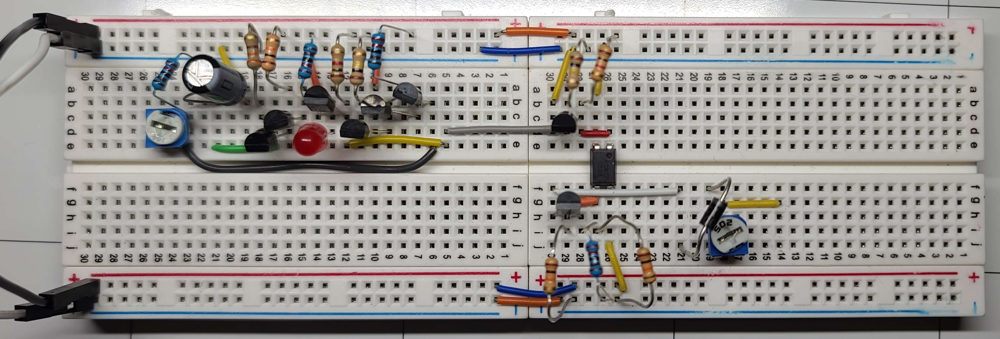 | 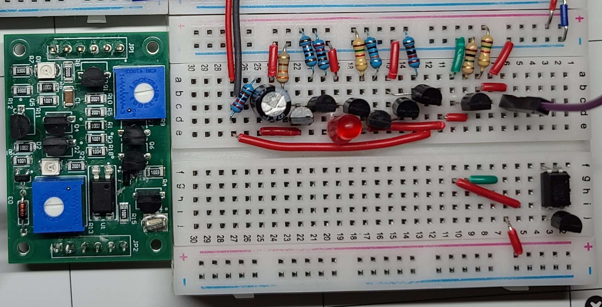 |

| PCB Board | PCB 3D Render |
|---|---|
| 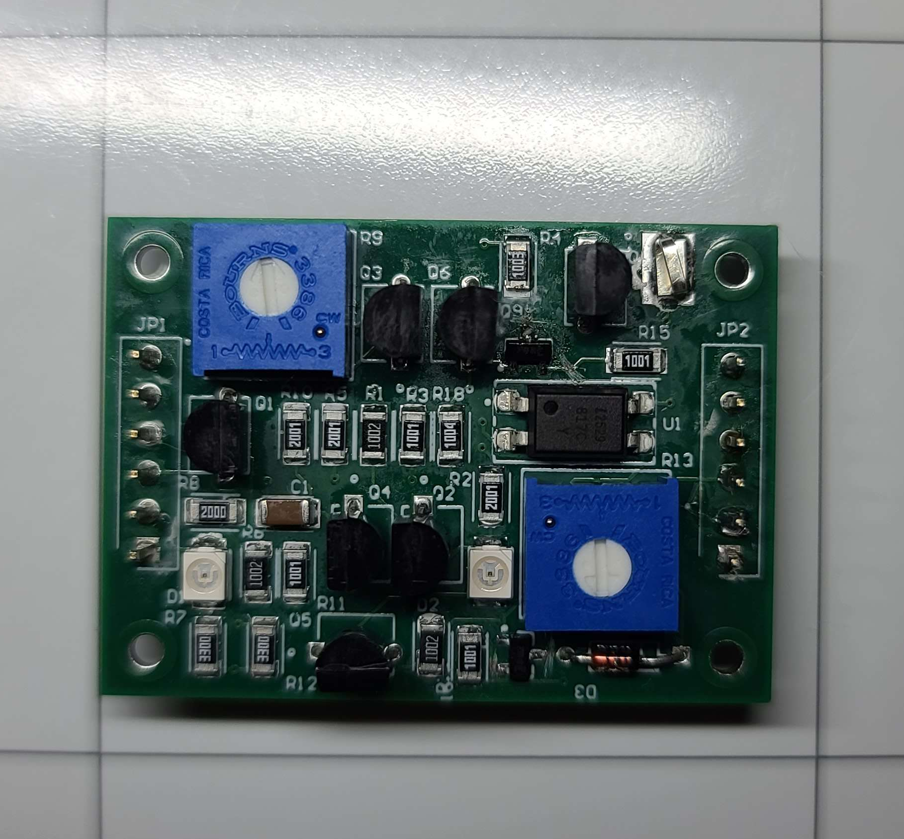 | 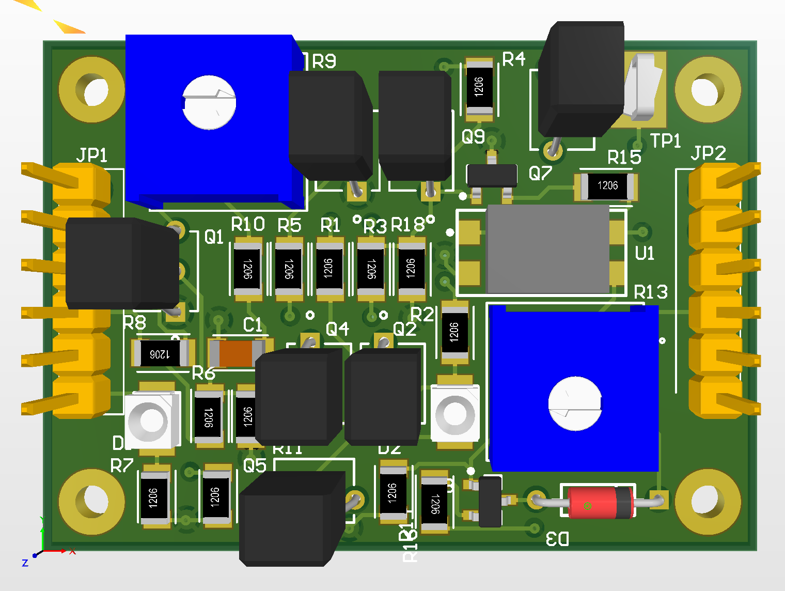 |

---

### Schematic

The **NeuronSynapseVersion7** schematic is the final design used across all builds.

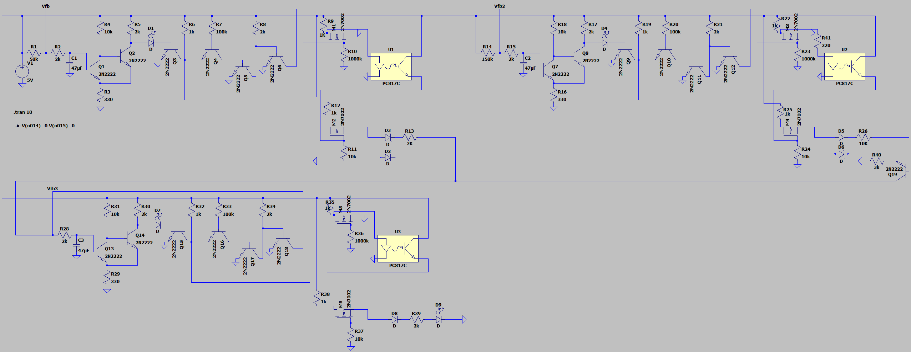

Source files: [`hardware/schematics/Neuron-Synapse-Version7-Schematic.asc`](hardware/schematics/Neuron-Synapse-Version7-Schematic.asc) (LTspice) and [`hardware/schematics/Neuron-Synapse-Version7-Kicad-Schematic.kicad_sch`](hardware/schematics/Neuron-Synapse-Version7-Kicad-Schematic.kicad_sch) (KiCad)

---

### PCB Design

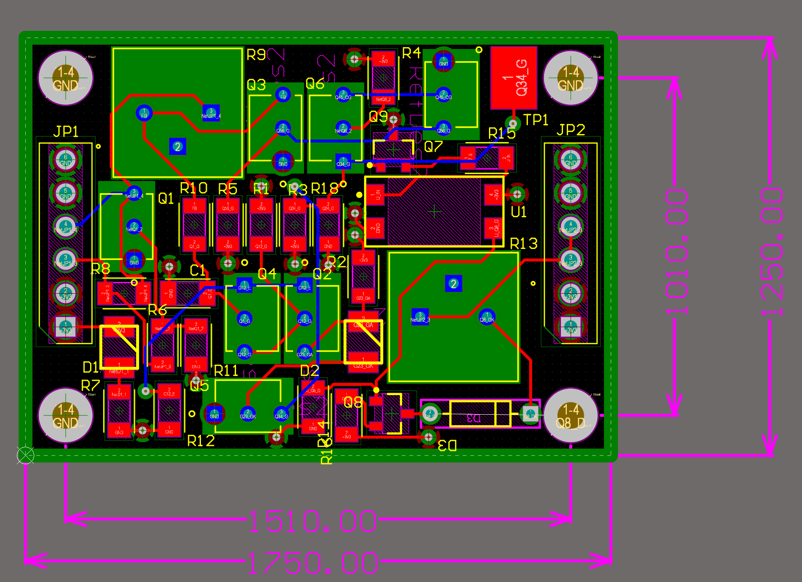

KiCad project: [`hardware/pcb/PCB-Neuron-V2-Kicad-Project.kicad_pro`](hardware/pcb/PCB-Neuron-V2-Kicad-Project.kicad_pro)

---

### Bill of Materials

[`hardware/bom/PCB BOM.csv`](hardware/bom/PCB%20BOM.csv)

---

### Datasheets

- [Espressif ESP32 Datasheet](hardware/datasheets-and-diagrams/Espressif-ESP32-Datasheet.pdf)
- [ESP32 DevKitC Pinout Diagram](hardware/datasheets-and-diagrams/Espressif-ESP32-DevkitC-PinOut-Diagram.png)

---

### Breadboard Assembly (NeuronSynapseVersion7)

The breadboard build uses the **NeuronSynapseVersion7** schematic found in `hardware/schematics/`.

1. Gather all components per the schematic's bill of materials.
2. Place the ESP32 on the breadboard so both rows of pins are accessible.
3. Wire the neuron circuit section by section, verifying each subcircuit before moving on.
4. Connect the neuron output node to **GPIO34 (ADC6)** and the stimulation node to **GPIO25 (DAC1)**.
5. Optionally wire a status LED to **GPIO2**.
6. For the dual-channel (Pong) configuration, add a second neuron output to **GPIO35 (ADC7)** and its input to **GPIO26 (DAC2)**.
7. Double-check all power rails (3.3 V and GND) before applying power.

---

### PCB Assembly

The PCB is functionally identical to the breadboard build — same connections, pin assignments, and component values in a more compact form factor. Assemble it using the same schematic and verification steps above.

---

### Flashing the ESP32

The firmware lives in `hardware/firmware/`. Two `.ino` files are provided — they are functionally identical except for the `CHANNEL_COUNT` parameter:

| `CHANNEL_COUNT` | Configuration | Used by |
|---|---|---|
| `1` | 3-neuron, single ADC channel (GPIO34) | Hit The Zone |
| `2` | 6-neuron, dual ADC channels (GPIO34 + GPIO35) | Pong |

1. Open the desired `.ino` file in **Arduino IDE**:
   - `NeuralSerial_SingleChannel_3Neuron.ino`
   - `NeuralSerial_DualChannel_6Neuron.ino`
2. Confirm or set `CHANNEL_COUNT` near the top of the file:
   ```cpp
   // Set CHANNEL_COUNT to 1 for 3-neuron HitTheZone config.
   // Set CHANNEL_COUNT to 2 for 6-neuron Pong config.
   #define CHANNEL_COUNT 1
   ```
3. Select **Tools → Board → ESP32 Dev Module** and the correct **Tools → Port**.
4. Click **Upload**, then open the **Serial Monitor** at 115200 baud to confirm the board is sending data.

---

## Running the Application

Download the latest release from the [Releases page](https://github.com/SJSU-CMPE-195/group-project-group-22/releases). The release includes the Java application and the ESP32 firmware.

### Java Application

Two distribution formats are available:

**Standalone JAR** — a single `hardware-neural-network.jar` file. Requires Java 17+ already installed on your system.

```bash
java -jar hardware-neural-network.jar
```

**Bundled runtime** — a folder called `hardware-neural-network/` containing a `.exe` alongside `app/` and `runtime/` directories. Java is included — no separate installation needed. Run the `.exe` inside the folder.

This opens the **Launcher**, which is the home page for all programs.

**Building from source** (optional):

```bash
git clone https://github.com/SJSU-CMPE-195/group-project-group-22.git
cd group-project-group-22/software
mvn install
java -jar target/hardware-neural-network.jar
```

### Firmware

The release also includes the `.ino` firmware files for the ESP32. See [Flashing the ESP32](#flashing-the-esp32) for installation instructions.

---

## Programs

**Summary Class Diagram**

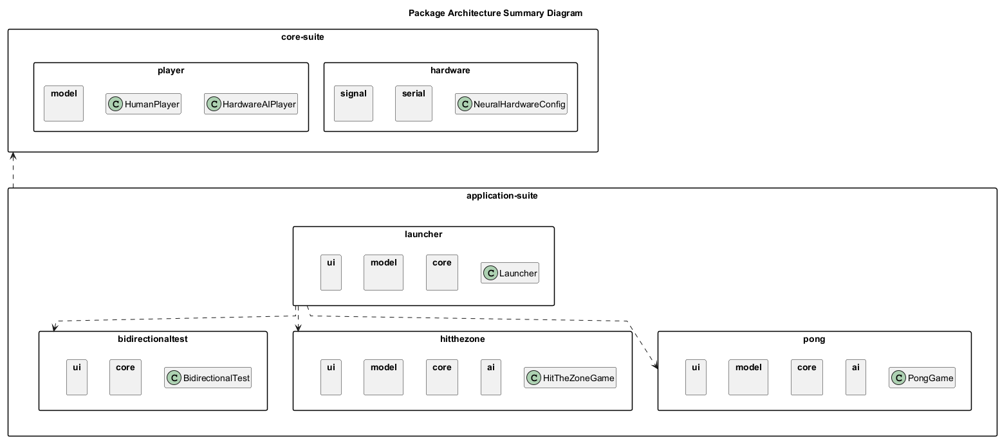

---

### Launcher

The Launcher is the home page of the application. It provides two serial connection panels — one for Hit The Zone (single-channel) and one for Pong (dual-channel) — and buttons to open each program.

Connect your ESP32 device(s) in the Launcher before opening a program to enable the hardware neural network AI player. Programs can also be launched without hardware — the neural player will simply be unavailable.

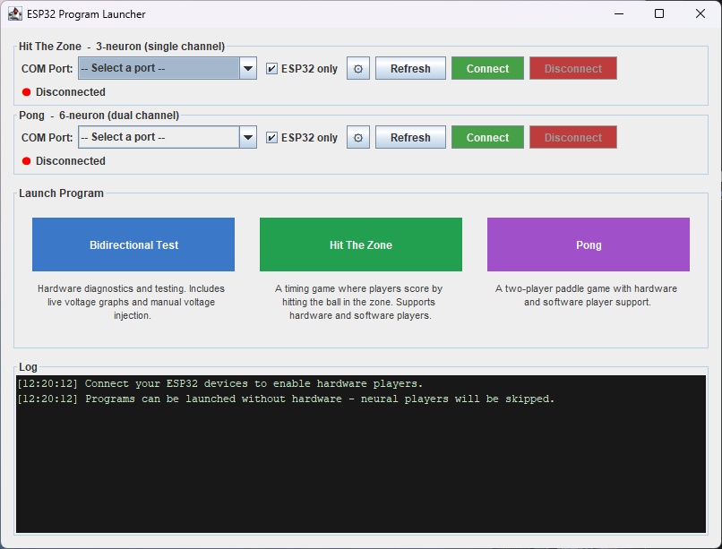

**Class Diagram**

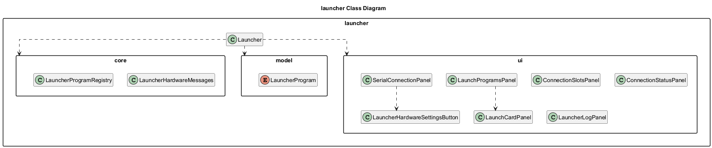

---

### Hit The Zone

A game where four players take turns hitting a ball as it passes through a target zone. The hardware SNN (using the 3-neuron, single-channel ESP32 firmware config) competes alongside two software AI bots and a human player.

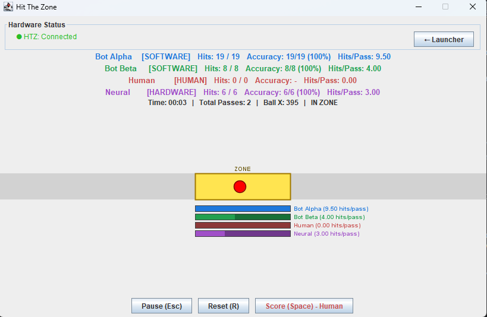

**Hardware Setup**

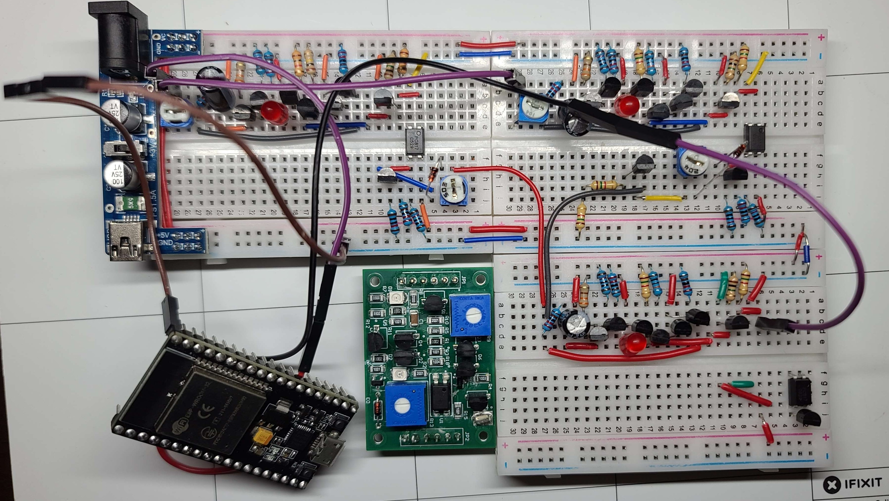

**Players:**
- **Bot Alpha / Beta** — software AI players
- **Human** — press Space when the ball is inside the yellow zone to score a hit
- **Neural** — the ESP32 hardware neural network player

**Controls:**

| Key | Action |
|---|---|
| Space | Hit the ball (when inside zone) |
| Esc | Pause / unpause |
| R | Reset the game |

**Stats tracked:** Hits (successful / total attempts), Accuracy (%), Hits/Pass (average hits per ball pass)

**Class Diagram**

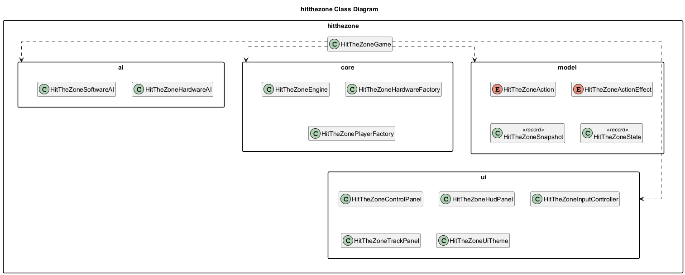

---

### Pong

A Pong game where the hardware SNN competes as an AI paddle controller. The ESP32 (6-neuron, dual-channel config) reads two ADC channels — GPIO34 for LEFT and GPIO35 for RIGHT — and drives a single hardware AI player. Player types (Human / Hardware AI / Software AI Easy / Software AI Hard) are selected from the in-game toolbar.

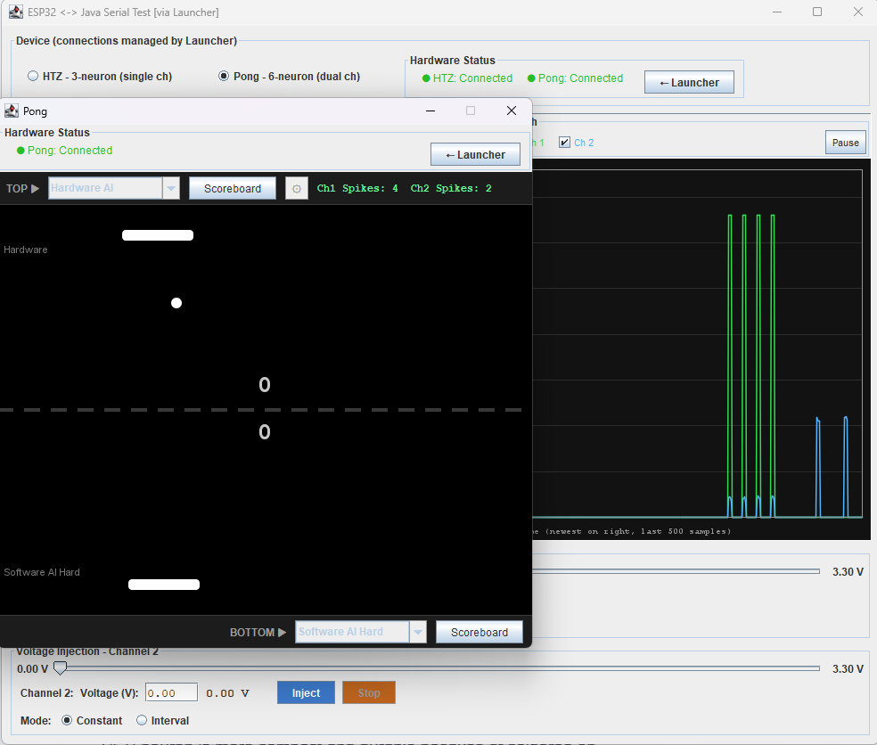

**Hardware Setup**

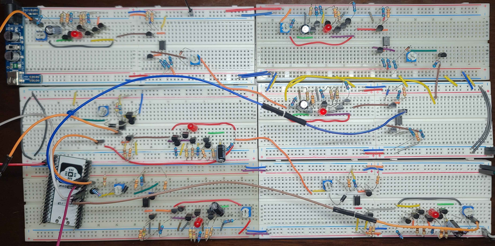

**Controls (Human player):**

| Key | Action |
|---|---|
| ← / → | Move paddle left / right |
| Esc | Pause / unpause |
| R | Reset the game (from pause menu) |
| C | Toggle constant ball speed (from pause menu) |
| 1 / 2 / 3 | Select ball speed level (from pause menu) |

**Class Diagram**

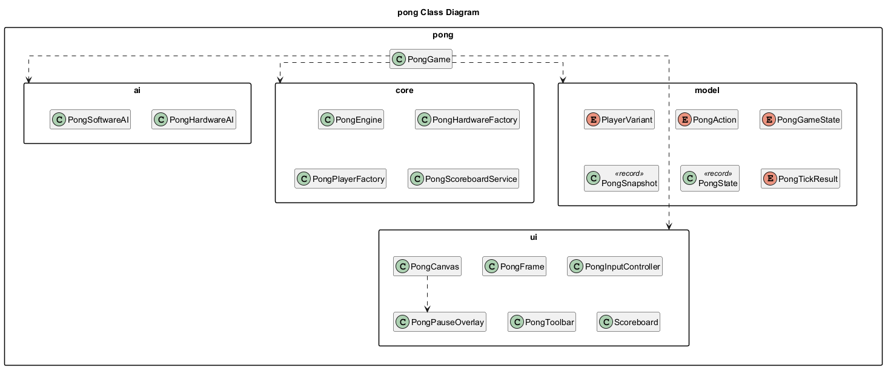

---

### Bidirectional Test

A diagnostic tool for verifying serial communication between the ESP32 and the Java application. It receives both Launcher-managed connections (Hit The Zone and Pong) and lets you switch between them to inspect bidirectional data flow — useful for debugging firmware behavior or confirming signal integrity before running a game.

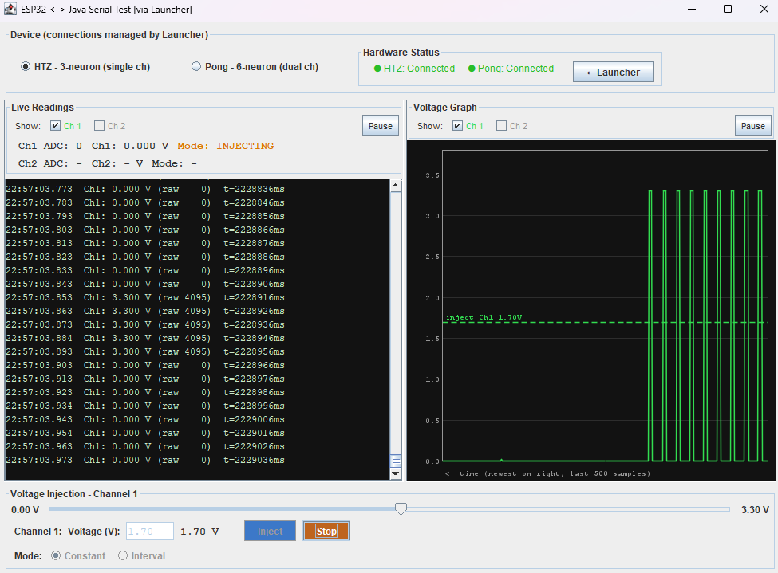

**Class Diagram**

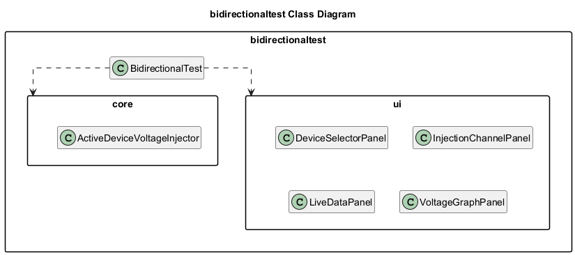

---

### Shared Components

The `hardware` and `player` packages are shared across all programs. `hardware` handles serial connection management and neural signal processing. `player` provides the base player abstractions used by every game.

**Hardware Class Diagram**

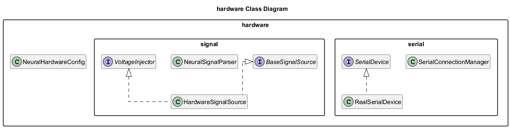

**Player Class Diagram**

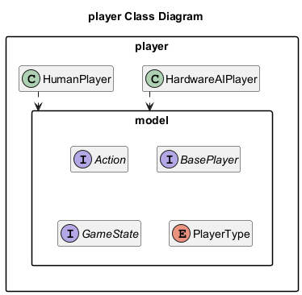

---

## Configuration

No API keys or environment variables are required. The only configuration is the `CHANNEL_COUNT` firmware parameter described in [Flashing the ESP32](#flashing-the-esp32).

---

## Testing

### Running the Test Suite

```bash
cd software
mvn verify
```

This runs all unit, integration, and stress tests and generates a JaCoCo HTML coverage report at `software/target/site/jacoco/index.html`.

> Tests that instantiate Swing components require a display. On Linux, prefix with `xvfb-run --auto-servernum`.

**Useful variants:**

```bash
# Stress tests only (no display required)
mvn test -Dgroups=stress

# A single test class
mvn test -Dtest=NeuralSignalParserTest
```

### Coverage

The latest coverage report is uploaded as the **`jacoco-coverage-report`** artifact on every CI run — see [Actions](https://github.com/SJSU-CMPE-195/group-project-group-22/actions/workflows/ci.yml).

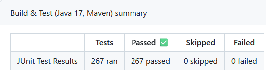

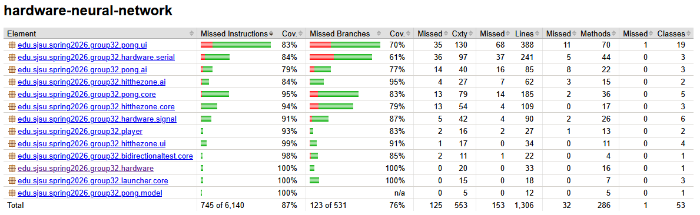

Full coverage details, per-package breakdown, and exclusion rationale are in [`docs/evaluation/coverage-report/README.md`](docs/evaluation/coverage-report/README.md).

### Stress Test Results

Documented in [`docs/evaluation/stress-test-results.md`](docs/evaluation/stress-test-results.md).

---

## Project Structure

```
group-project-group-22/
├── .github/
│   └── workflows/
│       └── ci.yml                       # Build, test, and coverage reporting
├── scripts/
│   └── generate-class-diagram.py        # Generates PlantUML source from Java source
├── hardware/
│   ├── firmware/                        # ESP32 Arduino firmware (single- and dual-channel) + archive/
│   ├── schematics/                      # KiCad + LTspice schematics, PNGs + archive/
│   ├── pcb/                             # KiCad PCB V2 project + archive/
│   ├── bom/                             # Bill of materials (CSV)
│   └── datasheets-and-diagrams/         # ESP32 datasheet and pinout diagram
├── software/
│   └── src/
│       ├── main/java/.../
│       │   ├── bidirectionaltest/       # Diagnostic tool — core/ + ui/
│       │   ├── hardware/                # Serial + signal processing — serial/ + signal/
│       │   ├── hitthezone/              # Hit The Zone game — ai/ + core/ + model/ + ui/
│       │   ├── launcher/                # Launcher home page — core/ + model/ + ui/
│       │   ├── player/                  # Shared player abstractions — model/
│       │   └── pong/                    # Pong game — ai/ + core/ + model/ + ui/
│       └── test/java/.../               # JUnit 5 + Mockito test suite + stress/ + testsupport/
├── docs/
│   ├── class-diagrams/                  # PNG class diagrams
│   │   ├── class-diagram-summary.png
│   │   ├── class-diagram-launcher.png
│   │   ├── class-diagram-hardware.png
│   │   ├── class-diagram-player.png
│   │   ├── class-diagram-hitthezone.png
│   │   ├── class-diagram-pong.png
│   │   ├── class-diagram-bidirectionaltest.png
│   │   └── plantuml-diagrams/           # PlantUML source (.puml)
│   ├── deliverables/                    # Project poster (SVG + PDF)
│   ├── evaluation/                      # coverage-report/ + stress-test-results.md
│   └── images/
│       ├── java-program/                # Application screenshots
│       ├── neural-network-game-setups/  # Hardware + game configuration photos
│       └── physical-hardware-builds/    # Build photos (breadboard, PCB)
└── tests/
    └── README.md                        # Test structure and instructions
```

---

## License

This project is licensed under the MIT License — see the [`LICENSE`](LICENSE) file for details.

> Distribution is subject to applicable San Jose State University intellectual property policies.
